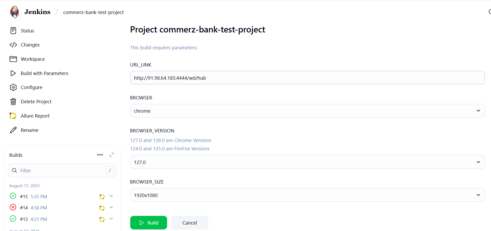

## Test automation project for [Commerzbank Poland Careers](https://lodz.commerzbank.pl/)

## Table of contents

- [Technologies and tools](#technologist-technologies-and-tools)  
- [Implemented checks](#bookmark-tabs-implemented-checks)  
- [Running tests from the terminal](#computer-running-tests-from-the-terminal)  
- [Running tests in Jenkins](#-running-tests-in-jenkins)  
- [Test results report in Allure Report](#-test-results-report-in-allure-report)  
- [Integration with Jira](#-integration-with-jira)  
- [Telegram notifications using a bot](#-telegram-notifications-using-a-bot)  
- [Test running example in Selenoid](#-test-running-example-in-selenoid)  

## :technologist: Technologies and tools

<p align="center">
  <code></code>
  <code></code>
  <code></code>
  <code></code>
  <code></code>
  <code></code>
  <code></code>
  <code></code>
  <code></code>
  <code></code>
  <code></code>
</p>

## :bookmark_tabs: Implemented checks

### :computer: UI Tests (Commerzbank Careers)

- **Main page → Careers navigation**  
  Open `lodz.commerzbank.pl` → accept cookies → switch to **EN** → click **Apply** → switch to new tab → verify header **“Join Commerzbank Team”**.

- **Find vacancy by title**  
  Open Commerzbank Careers home → click vacancy **“Test Engineer Intern”** → assert vacancy header is **“Test Engineer Intern”**.

- **Open application form from vacancy page**  
  On the vacancy page click **“Apply To Position”** → navigate to the application form.

- **Fill and validate application form**  
  Open the **apply** page → fill **Name / Email / Phone** → add **Work experience** (company, title, summary, dates) → add **Education** (school, field, summary, dates) → fill **Summary & Cover Letter** → accept **GDPR**.  
  *(final submit intentionally disabled for demo safety)*

> All tests run on **Selenoid**; each run attaches **screenshots**, **page source**, and **video** to Allure Report.

## :computer: Running tests from the terminal

- **Run locally**  
  ```bash
  gradle clean simple_test
- **Run remotely**
  ```bash
  gradle clean simple_test \
  -Dbrowser=${BROWSER} \
  -Dremote_url=${URL_LINK} \
  -Dbrowser_version=${BROWSER_VERSION} \
  -Dbrowser_size=${BROWSER_SIZE}

## 🖥️ Running tests in Jenkins

You can run tests directly from Jenkins, either on your own server or using the prepared project job.  

- **Example: Commerzbank Test Project**  
  Open [Jenkins Job](http://91.98.64.185:8080/job/commerz-bank-test-project/)  

1. Click **Build with Parameters**.  
2. Set the required parameters (browser, version, resolution, remote URL).  
3. Click **Build** to start the test run.  

<p align="left">
  
</p>

After the build is completed, in the **Builds history** opposite the build number will appear the **Allure Report** icon.  
Clicking on it will open the generated HTML report page.

<p align="left">
  
</p>

## 📊 Allure Report in Jenkins
<p align="left">
  
</p>

## Telegram Notifications
After the build is completed, a special bot created in **Telegram** automatically sends a notification with summarized test results.

<p align="center">
  
</p>
